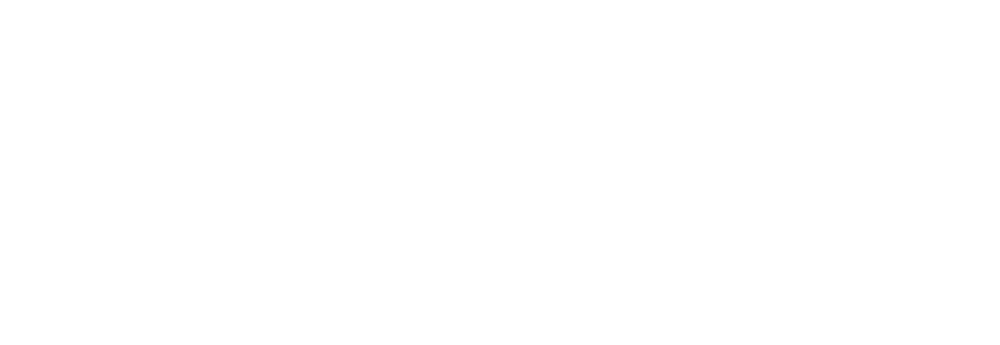

<section class="eg-hero">
  

    
School of Chemistry, University of Edinburgh

    <h1>Erastova Group GitHub Resources</h1>
    
Welcome to the GitHub page of the Erastova Group. We build and share codes, molecular models, teaching materials, and working resources for molecular modelling of natural minerals and materials.

    <a class="eg-link" href="https://www.erastova.xyz">Visit erastova.xyz</a>
  

  
</section>

---

## Codes

Software and scripts developed by the group to support molecular simulation setup, analysis, and interpretation.

- [DynDen](https://github.com/Erastova-group/DynDen)  
  A software to assess convergence of molecular dynamics simulations of interfacial phenomena.

- [Assemble!](https://github.com/Erastova-group/Assemble)  
  A tool for generating atomistic polymeric mixtures ready for simulation in GROMACS.

- [ClayCode](https://github.com/Erastova-group/ClayCode)  
  A tool to automate the setup of atomistic clay models for classical molecular dynamics simulations with GROMACS.

---

## Biochar Development

Repositories supporting the development of molecular models for biochars and their interactions with environmental species.

- [Biochar_MolecularModels](https://github.com/Erastova-group/Biochar_MolecularModels)  
  Molecular models of woody biochars at HTT 400 °C, 600 °C, and 800 °C, together with experimental property datasets.

- [Porous_Biochars_Models](https://github.com/Erastova-group/Porous_Biochars_Models)  
  Porous biochar molecular models created with the virtual atom approach, representative of woody biochars produced at 600–650 °C.

- [Mn_Biochar](https://github.com/Erastova-group/Mn_Biochar)  
  Atomistic models and GROMACS files for Mn(II) interactions with wood- and straw-derived biochars.

- [24D_biochar](https://github.com/Erastova-group/24D_biochar)  
  Molecular dynamics study of 2,4-D adsorption on biochar.

---

## ClayCode

ClayCode is a stand-alone code developed to support the construction of atomistic clay models for molecular dynamics simulations.

- [ClayCode](https://github.com/Erastova-group/ClayCode)  
  Main ClayCode repository.

- [ClayCode Workshop](https://github.com/Erastova-group/ClayCode-workshop)  
  Workshop materials and tutorials for using ClayCode.

---

## Teaching Materials

Teaching repositories and materials developed by the group. Some of these resources are hosted through [Edinburgh Chemistry Teaching](https://github.com/Edinburgh-Chemistry-Teaching) repositories. 

- [MD Research Techniques](https://github.com/Erastova-group/MD_ResearchTechniques)  
  Materials for the “Introduction to Computational Chemistry Techniques” course at the University of Edinburgh.

- [ClayCode Workshop](https://github.com/Erastova-group/ClayCode-workshop)  
  Workshop materials for learning how to use ClayCode.

- [Data-Driven Chemistry](https://github.com/Edinburgh-Chemistry-Teaching/Data-driven-chemistry)  
  An introductory Python course for undergraduate chemistry students.

More teaching materials will be added as they become available.

---

## Other links

- [Erastova Group website](https://www.erastova.xyz)
- [Erastova Group GitHub organisation](https://github.com/Erastova-group)
- [School of Chemistry, University of Edinburgh](https://www.chem.ed.ac.uk)
